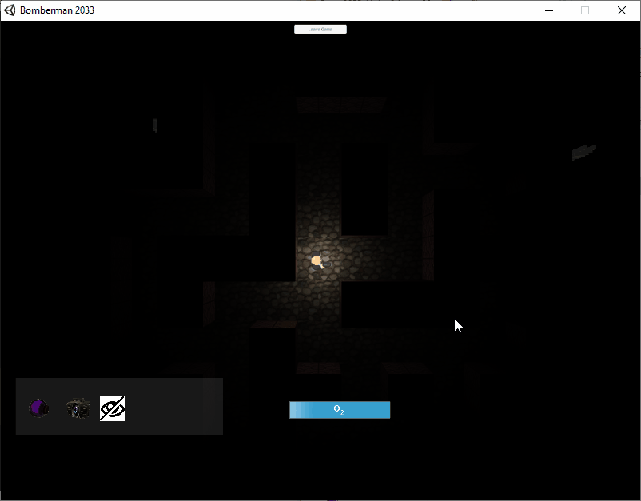

# Bman2033
## **Disclaimer** ##
This project has been made prior to my education in Bahcesehir University. 

## **Information** 
It is a multiplayer, survival game which can be played in either pvp or pve modes. The main threat is the snake that follows the chicken pieces. A new chicken piece spawn around the player when the last piece eaten by the snake. Snake uses "Depth First Search" pathfinding algorithm to reach to the chicken. Player have some skills in his disposal to survive as long as he can.

I've used the Photon Unity Networking library to establish the multiplayer part of the game.

###### Gameplay video:
[]https://youtu.be/D9RYGZ3ykMM

###### Pathfinding

###### Mine Skill

###### Portal Skill

